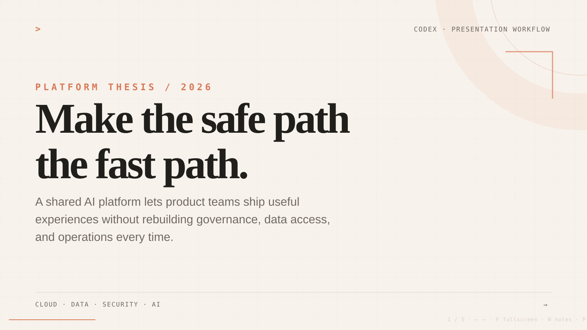

# Claude Code Slides

[](https://github.com/rufushsu9987/claude-code-slides/actions/workflows/ci.yml)
[](https://agent-plugins.org/)
[](./LICENSE)

**Agent-first presentation workflows for Codex, Claude Code, and Agent Plugins-compatible clients.**

Turn a topic, document, URL, or repository into a story-driven HTML, Marp, or editable PowerPoint deck. The plugin plans the narrative, selects a professional template, creates the files, validates the output, reviews delivery quality, and can add speaker notes.

[繁體中文](./README.zh-TW.md) · [Template gallery](./docs/templates.md)



## What makes it different

Claude Code Slides is not a one-shot “split this document into ten pages” prompt. It packages a repeatable workflow:

```text
source material
  → audience and decision
  → narrative architecture
  → visual direction and template
  → HTML / Marp / editable PPTX
  → deterministic validation
  → independent review
  → speaker notes and Q&A
```

The portable core follows Agent Plugins 1.0.0 and Agent Skills conventions. Native adapters preserve the best installation and invocation experience in Codex and Claude Code.

## Seven professional templates

Every preset supports HTML, Marp, and PPTX.

| Template | Best for |
| --- | --- |
| `terminal-editorial` | Technical talks, architecture reviews, AI and developer tooling |
| `executive-brief` | Leadership updates, strategy proposals, quarterly reviews |
| `cloud-architecture` | Infrastructure, platform engineering, security boundaries |
| `data-story` | Analytics, research findings, metrics and comparisons |
| `product-launch` | Product demos, launches, roadmaps and feature narratives |
| `dark-terminal` | Live demos, code walkthroughs and engineering deep dives |
| `incident-review` | Postmortems, impact timelines, root cause and remediation |

List or filter the installed presets:

```bash
codex-slides templates
codex-slides templates --format pptx --json
```

Create a deck with an explicit template:

```bash
codex-slides init "Quarterly Strategy Review" \
  --format pptx \
  --template executive-brief
```

Each generated deck includes `template.json` so the selected palette, typography, visual pattern and format remain reproducible.

## Skills

| Capability | Codex | Claude Code |
| --- | --- | --- |
| Create a deck | `$create-deck` | `/claude-code-slides:create-deck` |
| Review and improve | `$review-deck` | `/claude-code-slides:review-deck` |
| Add speaker notes | `$speaker-notes` | `/claude-code-slides:speaker-notes` |
| Apply the visual system | `$claude-code-style` | `/claude-code-slides:claude-code-style` |
| Plan the narrative | `$deck-architect` | Skill or `deck-architect` subagent |
| Direct the visuals | `$visual-director` | Skill or `visual-director` subagent |
| Run an independent audit | `$deck-reviewer` | Skill or `deck-reviewer` subagent |

## Install in Codex

```bash
codex plugin marketplace add \
  https://github.com/rufushsu9987/claude-code-slides.git \
  --ref main

codex plugin add claude-code-slides@rufus-slides
```

Start a new Codex session, then run:

```text
$create-deck

Analyze this repository and create a 10-slide Traditional Chinese architecture review.
Use editable PPTX and the cloud-architecture template.
Cover data flow, trust boundaries, deployment, operations, risks, and next steps.
```

For an existing marketplace snapshot:

```bash
codex plugin marketplace upgrade rufus-slides
```

When Codex reports that the marketplace is not configured as Git, remove and re-add it with the full GitHub URL shown above.

## Install in Claude Code

```bash
claude plugin marketplace add rufushsu9987/claude-code-slides
claude plugin install claude-code-slides@rufus-slides
```

Then run:

```text
/claude-code-slides:create-deck

Turn docs/architecture.md into a 12-minute architecture review.
Use editable PPTX and the executive-brief template.
```

After updating the plugin, start a new session or run `/reload-plugins`.

## Output formats

| Format | Best use | Output |
| --- | --- | --- |
| HTML | Live delivery, strong visual fidelity, offline playback, browser sharing | `index.html`, `theme.css`, `slides.js` |
| Marp | Markdown review, Git diffs, quick HTML/PDF generation | `deck.md`, `theme.css` |
| PPTX | Editable Microsoft PowerPoint and enterprise handoff | `deck.mjs`, generated `.pptx` |

The PPTX workflow uses editable text and shapes rather than flattening each page into an image.

## CLI

```bash
codex-slides templates
codex-slides init "AI Platform" --format html --template terminal-editorial
codex-slides init "Cloud Review" --format pptx --template cloud-architecture
codex-slides check slides/cloud-review
codex-slides doctor
```

`claude-slides` exposes the same interface.

## Repository architecture

```text
plugin.json                 Agent Plugins portable manifest
skills/                     portable Agent Skills
templates/catalog.json      professional template catalog
.codex-plugin/              Codex adapter
.agents/plugins/            Codex marketplace
.agents/skills/             repository-scoped Codex discovery
.claude-plugin/             Claude Code manifest and marketplace
agents/                     Claude Code subagents
bin/ + lib/                 zero-dependency scaffolding and validation CLI
templates/                  HTML, Marp and PptxGenJS bases
```

## Development

```bash
git clone https://github.com/rufushsu9987/claude-code-slides.git
cd claude-code-slides
npm ci
npm run sync:skills
npm run check
```

The test suite scaffolds every template in all three formats, validates portable and native manifests, verifies skill resources, and checks the runnable example deck.

## Independence

This is an independent community project. It is not maintained, endorsed, or affiliated with Anthropic or OpenAI. The name describes the bundled developer-tool-inspired presentation direction; no official logos or proprietary product UI are included.

## License

MIT
